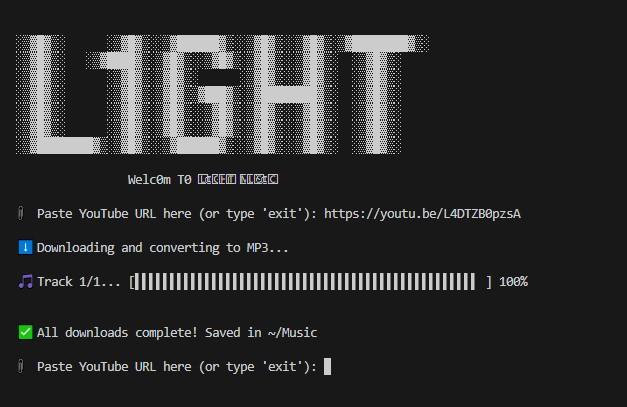

# L1ght Music Downloader

A sleek command-line tool for downloading audio from YouTube videos and playlists in MP3 format.




## Features

- 📥 Download audio from YouTube videos and playlists
- 🎵 Automatic conversion to high-quality MP3 format
- 📊 Visual progress bar with percentage display
- 🖼️ Stylish ASCII art interface
- 💾 Organized file saving to your Music directory

## Installation

### Prerequisites

- Python 3.6 or higher
- pip (Python package installer)

### Setup

1. Clone this repository or download the source code:

```bash
git clone https://github.com/nour23019870/l1ght-music.git
cd light-music
```

2. Create a virtual environment (optional but recommended):

```bash
python -m venv env
```

3. Activate the virtual environment:

- On Windows:
```bash
env\Scripts\activate
```
- On macOS/Linux:
```bash
source env/bin/activate
```

4. Install the required packages:

```bash
pip install -r requirements.txt
```

## Usage

Run the application:

```bash
python main.py
```

1. When prompted, paste a YouTube URL (video or playlist)
2. The program will download the audio and save it as MP3 in your "Music" folder
3. To exit, type 'exit' at the URL prompt

## Example

```
📎 Paste YouTube URL here (or type 'exit'): https://www.youtube.com/watch?v=dQw4w9WgXcQ
⬇️ Downloading and converting to MP3...
🎵 Track 1/1... [▌▌▌▌▌▌▌▌▌▌▌▌▌▌▌▌▌▌▌▌▌▌▌▌▌▌▌▌▌▌▌▌▌▌▌▌▌▌▌▌▌▌▌▌▌▌▌▌▌▌] 100%
✅ All downloads complete! Saved in ~/Music
```

## Dependencies

- [yt-dlp](https://github.com/yt-dlp/yt-dlp) - A youtube-dl fork with additional features and fixes

## License

This project is licensed under the MIT License - see the LICENSE file for details.

## Disclaimer

This tool is for personal use only. Please respect copyright laws and YouTube's Terms of Service when using this application.

## Contributing

Contributions are welcome! Please feel free to submit a Pull Request.

1. Fork the repository
2. Create your feature branch (`git checkout -b feature/amazing-feature`)
3. Commit your changes (`git commit -m 'Add some amazing feature'`)
4. Push to the branch (`git push origin feature/amazing-feature`)
5. Open a Pull Request