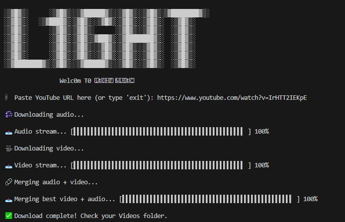

# L1ght Video Downloader

<div align="center">
  


**A stylish terminal-based YouTube downloader for highest quality videos**

[](https://www.python.org/)
[](https://ffmpeg.org/)
[](https://github.com/yt-dlp/yt-dlp)
[](LICENSE)

</div>

## 📋 Description

L1ght Video is a sleek, terminal-based YouTube video downloader that combines style with functionality. It downloads videos from YouTube in the highest available quality, with a visually appealing interface featuring animated progress bars and elegant ASCII art.

The tool downloads the best video and audio streams separately, then merges them to ensure maximum quality, all while providing a seamless user experience with real-time progress indicators.

## ✨ Features

- 🎬 **Maximum Quality**: Downloads best available video and audio streams
- 🔄 **Automatic Merging**: Combines separate streams for optimal quality
- 📊 **Animated Progress Bars**: Visual real-time download progress
- 💾 **Convenient Storage**: Saves to user's Videos folder automatically
- 🖥️ **Terminal UI**: Stylish ASCII art interface
- 🛑 **Error Handling**: Robust error management with informative messages
- 🔌 **Simple Interface**: Just paste a YouTube URL and go

## 🛠️ Requirements

- Python 3.7 or higher
- FFmpeg (bundled with the project)
- Internet connection

## 📥 Installation

1. Clone the repository:
```bash
git clone https://github.com/nour23019870/l1ght-video-downloader.git
cd l1ght-video-downloader
```

2. Install dependencies:
```bash
pip install -r requirements.txt
```

*Note: This project includes FFmpeg binaries, so no separate FFmpeg installation is required.*

## 📝 Usage

1. Run the script:
```bash
python main.py
```

2. When prompted, paste the YouTube URL of the video you want to download.

3. Wait for the download and merging process to complete.

4. Find your downloaded video in your system's Videos folder.

## 🔧 How It Works

1. **Initialization**: The program starts with a stylish ASCII banner
2. **Input**: User provides a YouTube video URL
3. **Audio Download**: Downloads the highest quality audio stream
4. **Video Download**: Downloads the highest quality video stream
5. **Merging**: Combines the audio and video streams using FFmpeg
6. **Cleanup**: Removes temporary files
7. **Completion**: Notifies the user when the download is complete

## 📋 Dependencies

- [yt-dlp](https://github.com/yt-dlp/yt-dlp): Advanced fork of youtube-dl for downloading YouTube videos
- [FFmpeg](https://ffmpeg.org/): Complete, cross-platform solution for video processing

## 📋 Project Structure

```
light-video-downloader/
├── main.py              # Main script
├── ffmpeg.exe           # FFmpeg binary
├── ffplay.exe           # FFplay binary
├── ffprobe.exe          # FFprobe binary
└── ffmpeg-7.1.1/        # FFmpeg documentation and additional files
```

## ⚖️ License

This project is licensed under the MIT License - see the LICENSE file for details.

## 🙏 Credits

- [yt-dlp](https://github.com/yt-dlp/yt-dlp) team for their excellent YouTube download library
- [FFmpeg](https://ffmpeg.org/) for video processing capabilities
- ASCII art generated for the L1ght Video banner

---

<div align="center">
  <sub>Built with ❤️ by L1ght for efficient video downloading</sub>
</div>