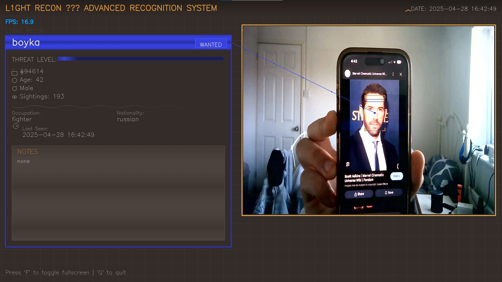

# L1GHT REC0N: Advanced Face Recognition System


A sophisticated face recognition system with advanced visual interface, real-time detection, and comprehensive profile management capabilities.



## ✨ Features

- **Advanced UI**: Modern, animated interface inspired by sci-fi technology
- **Real-time Face Detection**: Fast and accurate face detection using OpenCV DNN
- **Profile Management**: Create, store and display detailed profiles for recognized individuals
- **GPU Acceleration**: CUDA support for improved performance (when available)
- **Face Registration Tool**: Easy-to-use utility for adding new faces to the database
- **Animated Details**: Dynamic visual effects including scanning animations and data visualization
- **Dynamic Profile Display**: Responsive profile boxes with threat level indicators and personal details

## 📋 Requirements

- Python 3.10 or higher
- OpenCV 4.11.0 with or without CUDA support
- Webcam or video input device
- NVIDIA GPU with CUDA support (optional, for acceleration)

## 🚀 Installation

1. **Clone the repository**
   ```
   git clone https://github.com/nour23019870/light-recon-face-recognition.git
   cd light-recon-face-recognition
   ```

2. **Install dependencies**
   ```
   pip install -r requirements.txt
   ```

3. **Download model files**
   The required model files will be downloaded automatically when running any of the scripts for the first time. Alternatively, you can download them manually:
   
   - [deploy.prototxt](https://raw.githubusercontent.com/opencv/opencv/master/samples/dnn/face_detector/deploy.prototxt)
   - [res10_300x300_ssd_iter_140000.caffemodel](https://raw.githubusercontent.com/opencv/opencv_3rdparty/dnn_samples_face_detector_20170830/res10_300x300_ssd_iter_140000.caffemodel)
   - [openface_nn4.small2.v1.t7](https://github.com/pyannote/pyannote-data/raw/master/openface.nn4.small2.v1.t7)

## 📊 Project Structure

```
face_reco/
├── main.py                     # Main entry point for the application
├── person_profiles.py          # Profile management and advanced UI components
├── face_scanner.py             # Tool for adding new faces to the database
├── deploy.prototxt             # Face detection prototxt file
├── res10_300x300_ssd_iter_140000.caffemodel  # Face detection model
├── openface_nn4.small2.v1.t7    # Face recognition model
├── dataset/                    # Directory containing face images and profiles
│   └── [person_name]/          # Individual folders for each person
│       ├── [images].jpg        # Face images used for recognition
│       └── profile.json        # Profile information in JSON format
└── encodings/                  # Directory for storing face encodings
```

## 🔧 Usage

### Main Application

Run the main application to launch the advanced face recognition system:

```bash
python main.py
```

Controls:
- Press `F` to toggle fullscreen mode
- Press `ESC` or `Q` to quit
- Press `D` to toggle detailed profile view

### Face Scanner Tool

Use the face scanner tool to add new people to the database:

```bash
python face_scanner.py
```

Controls:
- Press `C` to manually capture an image
- Press `A` to toggle auto-capture mode
- Press `Q` to quit

## 🔍 How It Works

L1GHT REC0N uses a multi-stage approach for face recognition:

1. **Face Detection**: Uses a pre-trained Caffe model to locate faces in the video stream
2. **Feature Extraction**: Utilizes OpenFace neural network to extract 128-dimensional feature vectors from each detected face
3. **Face Recognition**: Compares extracted feature vectors with known faces using cosine similarity
4. **Profile Display**: Shows detailed profile information with dynamic visual elements for recognized individuals

The system stores profile information in individual JSON files, making it easy to manage and update details for each person.

## 📷 Face Scanning Process

The face registration system allows you to:
1. Create a new profile for a person with customizable attributes
2. Capture multiple images of the person's face from different angles
3. Automatically detect and extract faces from captured images
4. Save profile information and face images for future recognition

## 💻 GPU Acceleration

L1GHT REC0N supports GPU acceleration through CUDA when available. To use GPU acceleration:

1. Install OpenCV with CUDA support:
   ```bash
   pip uninstall opencv-python
   pip install opencv-contrib-python-cuda
   ```

2. Make sure you have NVIDIA CUDA Toolkit installed
3. The application will automatically detect and use CUDA if available

## 👥 Profile System

Each profile contains detailed information about an individual:

- Basic information (name, age, gender)
- Demographic data (nationality, occupation)
- System-specific data (status, threat level, sighting count)
- Notes and additional information
- Last seen timestamp

## 🛠️ Customization

L1GHT REC0N can be customized in several ways:

- Modify profile attributes in the `PersonProfile` class
- Adjust detection parameters for improved performance
- Customize the visual interface by modifying the draw functions
- Add new profile fields by updating the profile schema

## 🤝 Contributing

Contributions to L1GHT REC0N are welcome! Please feel free to submit a Pull Request.

## 📄 License

This project is licensed under the MIT License - see the LICENSE file for details.

## ⚠️ Disclaimer

This software is provided for educational and research purposes only. The developers assume no liability and are not responsible for any misuse or damage caused by this program.

## 📬 Contact

For questions or suggestions, please open an issue in the GitHub repository.

---

Developed with ❤️ by L1ght